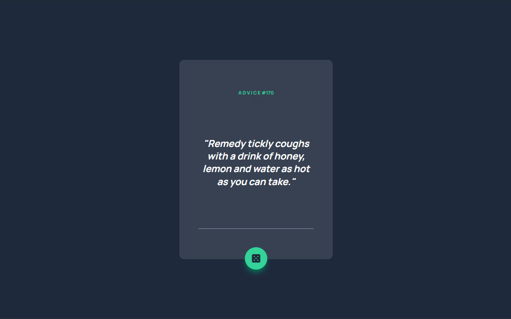
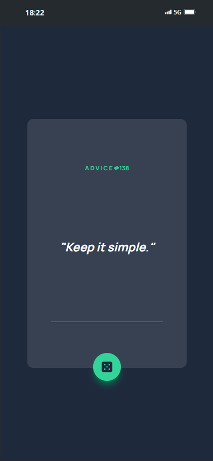

# Gerador de Conselhos

Este projeto é um aplicativo web que exibe conselhos aleatórios aos usuários. Foi desenvolvido utilizando React, Tailwind CSS e TypeScript. Os conselhos são obtidos de uma API externa e exibidos de forma elegante na interface do usuário.

## 🚀 Funcionalidades

- **Obtenção de Conselhos**: Busca conselhos aleatórios de uma API externa.
- **Interface Responsiva**: Interface de usuário amigável e responsiva.
- **Botão de Atualização**: Botão para buscar um novo conselho.

## 📸 Captura de Tela




## 🛠️ Tecnologias Utilizadas

- **React**: Biblioteca JavaScript para construção de interfaces de usuário.
- **Tailwind CSS**: Framework CSS utilitário para estilização rápida e eficiente.
- **TypeScript**: Superset do JavaScript que adiciona tipagem estática ao código.
- **Axios**: Cliente HTTP baseado em Promises para o navegador e para Node.js.
- **API**: API externa para obter conselhos aleatórios.

## ⚙️ Como Executar o Projeto

1. Clone o repositório:
   ```sh
   git clone https://github.com/raphaeleliass/advice-generator
   ```
2. Navegue até o diretório do projeto:
   ```sh
   cd advice-generator
   ```
3. Instale as dependências:
   ```sh
   npm install
   ```
4. Inicie o servidor de desenvolvimento:
   ```sh
   npm run dev
   ```

## 📝 Uso

1. Ao carregar a página, um conselho aleatório será exibido.
2. Clique no botão com o ícone de dado para obter um novo conselho.

## 🤝 Contribuições

Contribuições são sempre bem-vindas! Se você tiver sugestões ou melhorias, por favor, abra uma issue ou envie um pull request.

## 📧 Contato

Se você quiser discutir sobre o projeto ou oportunidades de trabalho, sinta-se à vontade para me contatar:

- **LinkedIn**: [Meu Linkedin](https://linkedin.com/in/seuperfil/)
- **Instagram**: [Meu Instagram](https://instagram.com/raphaeleliass)
